# ANALYSIS OF THE MOST NUTRIENT DENSE FOODS
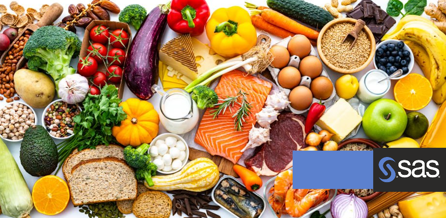
### INTRODUCTION
This SAS coded project analyzes the most nutrient dense foods by category for specific health goals. This analysis aims to simplify the consumption of foods most dense in Macronutrients (Carbs, Fats, Protein) and high in Micronutrients. This analysis will provide insight on dietary information which allows readers to make data driven decisions to efficiently fulfill specific dietary requirements and goals. 
### PROBLEM STATEMENT
1. What foods are the highest in carbohydrates?
2. What foods are highest in protein?
3. What foods are the highest in saturated fats?
4. What foods have the best electrolyte content? (Based on Sodium, Potassium, Calcium)
5. Which foods have the most b-vitamins and protein content? (Energy production.)
6. What are the top 100 low carbohydrate options with high fiber?
7. Which foods are best to increase testosterone? (Vitamin D, Cholesterol, selenium, B vitamins, protein)
8. Highest protein, fat and a healthy range of carbs?
9. What are good low carb and low fat foods?
10. What are good low carb and high protein foods?
11. What is the correlation between carbohydrates and sugar content?
12. What are the top foods to support a healthy intake of macronutrient consumption? (i.e. Healthy carb range, sufficient fat, and high protein)
13. What is the correlation between a healthy electrolyte balance and consuming the right macronutrients?

### SKILLS / CONCEPTS DEMONSTRATED
#### **Data Manipulation / Data modelling**
- Cleaning & structuring data, freq tables, sorting data sets, separating data sets, removing outliers
#### **Data Visualization**
- Freq plots, pie charts, gcharts.
#### **Statistical analysis**
- Mean, median, standard deviations, simple random sampling, paired sample test, data correlation, regression models, anova
- Interpretation of analysis techniques
  
### THE DATA
This data was obtained from kaggle [link](https://www.kaggle.com/datasets/mexwell/food-vitamins-minerals-macronutrient) by using the United States Department of Agriculture’s Food Composition Database.

This data has over 7000 food records, and 29 nutrient rows. It was imported as an Excel (.xlsx) file into SAS then converted into a (.sas7bdat) file. A backup was created.
```sas
	Data Amir.foodFilebk;
	set Amir.foodFile;
	run;
```

### DATA MANIPULATION
- Clean (no duplicates, outliers, inconsistent data, etc.) and label the categories
```sas
Data Amir.foodFile;
set Amir.foodFile;
label 	Category = 'General Category'
		Description = 'Description or Food preparation'
		DataBNum = 'Nutrient Data Bank Number'
		AlphaCar = 'Alpha Carotene mcg'
		BetaCaro = 'Beta Carotene mcg'
    /*and so on..*/
run;
```
- Verify data types for easy analysis (char, num)
- Sort by Nutrient Data Bank Number, ascending, or descending
```sas
  /*No duplicate refs found in drfoodfile*/
  proc sort data = Amir.FoodFile out=Amir.dfFoodFile dupout=Amir.drFoodFile nodup;
  by DataBNum;
run;
```
#### Structure data:
- Create tables based on problem statement for analysis
```sas
  /*What are the top 100 low carb options with high fiber? */
  Data Amir.lchffood;
  set Amir.foodfile;
  where carbs < 20 and fiber > 3;
  keep Category Description DataBNum carbs fiber;
  run;
```
- Minimize list to top sources of nutrients based on problem statement
```sas
/*What foods have the best electrolyte content? Calcium. Magnesium. Phosphorus. Potassium. Sodium. - but based on Sodium, Potassium, Calcium*/
/*above 10% - 230 for sod, 150 - pot,  */
Data Amir.sodFood Amir.potFood Amir.calFood Amir.oeFood;
set Amir.foodfile;
if Sodium < 1500 and Sodium > 300 then output Amir.sodFood; /*good range of sodium*/
else if Potassium > 300 and Potassium < 1500 then output Amir.potFood; /*good range of K*/
else if Calcium >  150 and Calcium < 1000 then output Amir.calFood; /*good range of calcium*/
else output Amir.oeFood;
keep Category Description DataBNum calcium magnesium potassium phosphorus sodium;
run;

/*take the top 25 of each and place in seperate files*/
proc sql outobs=25;
   create table sodfood25
     as select * from Amir.sodFood
     order by sodium desc;
quit;

proc sql outobs=25;
   create table potfood25
     as select * from Amir.potfood
     order by potassium desc;
quit;

proc sql outobs=25;
   create table calfood25
     as select * from Amir.calfood
     order by calcium desc; /*sort highest to lowest calcium value then take top 25*/
quit;
```
- Incorporate proc means for easy analysis of top food categories
```sas
/* What category of foods are the highest in carbs? */

/* Calculate the mean for the food categories, high frequency foods will be averaged */
proc means data=Amir.hcfood noprint nway ;
var carbs;
class &vcat;
output out=Amir.hcmean mean=carbmean; /* output file with mean variables based on food categories */
run;

/* Sort the data for the highest carb (or lowest) nutrient content first */
proc sort data=Amir.hcmean;
by descending carbmean;
run;

/* Seperate table for the top 25 data (nutrient sources) to be displayed*/
data Amir.tophcmean;
set Amir.hcmean;
if _n_ <= &top25;
run;

/*This data is then graphed based on the top sources table - as directed by the problem statement */
```
- Integrate join techniques to specify nutrient densities
```sas
/*based on procedure (good practice) ensure no duplicates then join*/
proc sort data=Amir.lcfood out=Amir.dflcfood nodup;
by dataBNum;
run;

proc sort data=Amir.hpfood30 out=Amir.dfhpfood30 nodup;
by dataBNum;
run;

/*inner join high protein 30g low carb < 15g*/
proc sql;
create table Amir.lchp_ij as
select dfhpfood30.DataBNum, dfhpfood30.category, dfhpfood30.description, *
from Amir.dflcfood inner join Amir.dfhpfood30
on dflcfood.dataBNum = dfhpfood30.dataBNum; quit;

/*right join high protein 30g low carb < 15g*/
proc sql;
create table Amir.lchp_rj as
select dfhpfood30.DataBNum, dfhpfood30.category, dfhpfood30.description, *
from Amir.dflcfood right join Amir.dfhpfood30 
on dflcfood.dataBNum = dfhpfood30.dataBNum; quit;

/*left join*/
proc sql;
create table Amir.lchp_lj as
select dflcfood.DataBNum, dflcfood.category, dflcfood.description, *
from Amir.dflcfood left join Amir.dfhpfood30
on dflcfood.dataBNum = dfhpfood30.dataBNum; quit;

/*full join of low fat and high protein*/
proc sql;
create table Amir.lfhp_fj as
select coalesce (dflcfood.dataBNum, dfhpfood30.dataBNum) as DataBNum, 
		coalesce (dflcfood.description, dfhpfood30.description) as Description,
		coalesce (dflcfood.category, dfhpfood30.category) as category, *
from Amir.dflcfood full join Amir.dfhpfood30
on dflcfood.dataBNum = dfhpfood30.dataBNum; quit;
```

### VISUALIZATION
#### The main techniques used to visualize are:
1. Gchart: vbar, hbar.
```sas
	/* Hbar for low carb, low fat foods */
	/*Create graph to display the results*/
	title'Low Carb & Low Fat categories';
	proc gchart data=Amir.toplclfmean; 
	hbar &vcat / discrete type=sum sumvar=totalFat_mean nostats;
	run;
	quit;
``` 
2. Gchart: Pie 
```sas
	/* pie chart for calcium */
	title 'High Calcium categories';
	proc gchart data = Amir.topcalmean;
	pie &vcat / discrete percent = inside sumvar = calmean;
	format calmean 7.0;
	run; quit;
```
3. Frequency plots / Frequency tables
```sas
	/* Low carb High fiber, top 10 sources freq table freq plot */
	proc freq data= Amir.lchfother ORDER=data;   /* order by data and use WEIGHT statement for count */
	tables TopCatlchf / plots=FreqPlot(scale=percent);
	weight Count;                  
	run;	
```

#### Below are the corresponding visualizations for the problem statements: 
**1. Highest Carbohydrate categories**

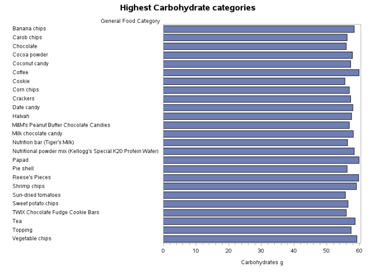

**2. Highest Protein categories**

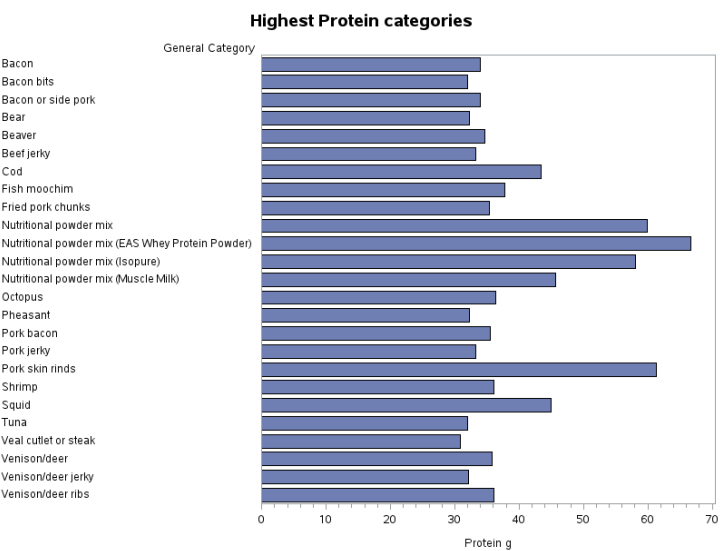 

**3. Highest Saturated fats categories**

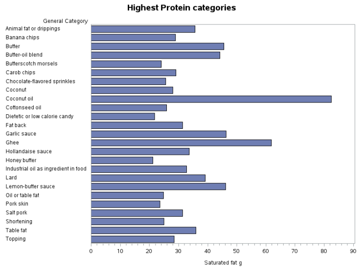

**4. Highest Electrolyte content categories**
Sodium       |     Potassium     |      Calcium
:------------:|:-----------------:|:---------:
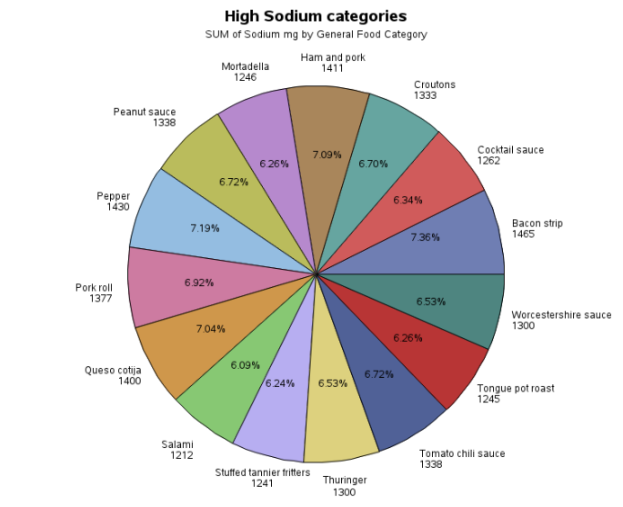 | 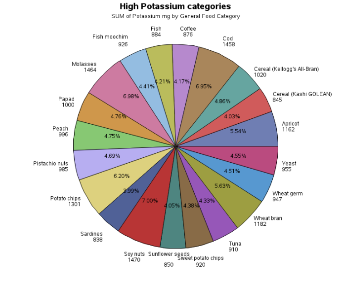 | 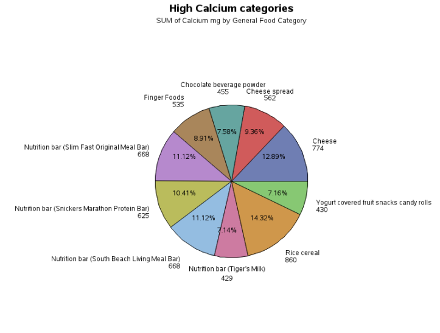

**5. Highest B-Vitamin and Protein categories**

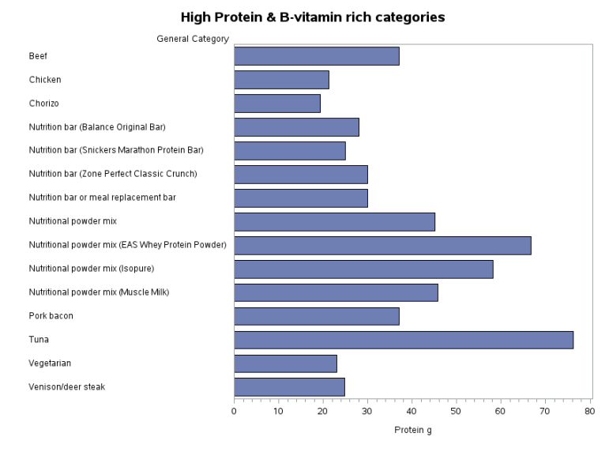

**6. Low Carbs and High fiber content**

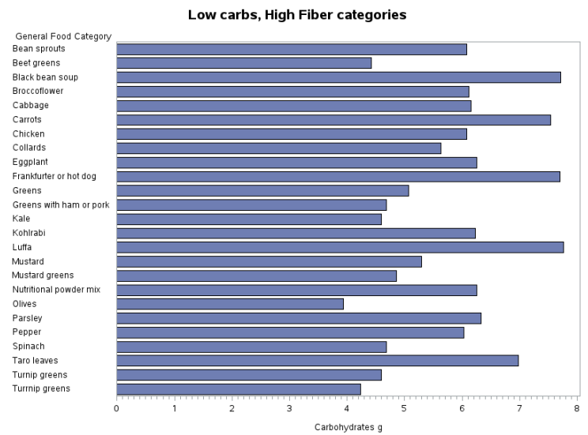

**7. Highest Testosterone boosting categories**

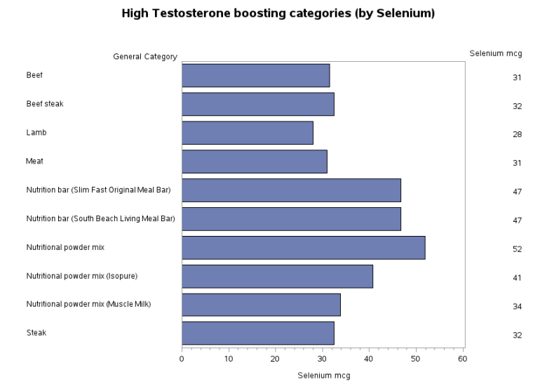

**8. Healthiest categories of Protein, Fats, and Carbohydrates**
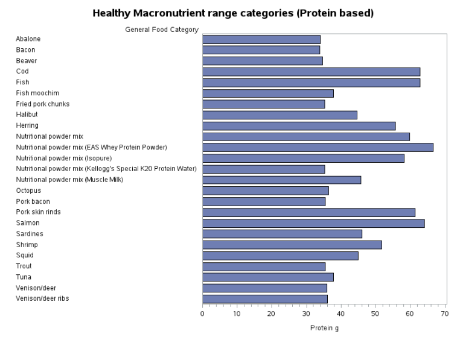

**9. Lowest Carbohydrates and Lowest Fat categories**
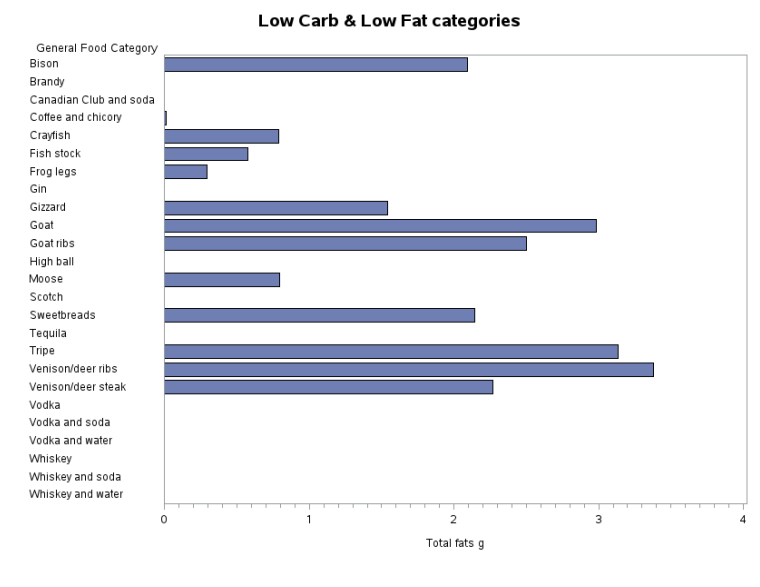

**10. Lowest Carbohydrate and high Protein categories**
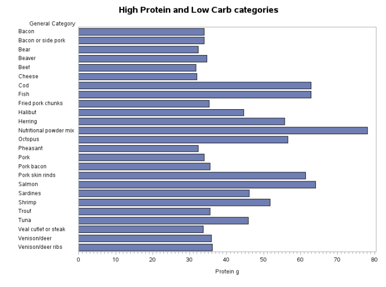

### STATISTICAL ANALYSIS
**The main techniques used for statistical analysis are:**
1. PROC MEANS - mean, median, standard deviation
```sas
/* Mean Median Std Dev of the top 200 high protein, fat and healthy carbs*/
proc means data = Amir.hcfood200 order=freq mean median stddev;
var carbs;
class category;
run;
```
   
2. PROC UNIVARIATE
```sas
/* Univariate of top 600 foods based on protein fat and carbs*/
proc univariate data=Amir.mergehfcp;
var carbs protein totalFat;
run;
```
3. Simple Random Sampling SRS (1000 observations)
```sas
/* Simple random sampling*/
proc surveyselect data = Amir.foodfile method=srs n=1000 out=Amir.foodSample;
run;
```
4. Paired sample test
```sas
/* Paired sample test */
/* H0: There is no significant mean difference between 2 variables from 0 */
/* H1: There is a significant mean difference between 2 variables from 0 */
proc ttest data = Amir.foodsample;
paired carbs*sugartot;
run;
/* PR: <.0001 (less than 0.05)- therefore this is contributing highly and the null hypothesis is rejected */
```
5. Correlation values
```sas
proc corr data=Amir.foodsample;
var carbs sugartot;
run;
/* Correlation value: 0.71841 is a strong positive correlation between sugar and carbs */
```
6. Linear Regression model
```sas
/* Linear regression Model */
proc reg data = Amir.foodsample;
	model protein = sodium;
run; quit;
/* ftest: <.0001 - contributing highly */
```
7. ANOVA
```sas
proc Anova data = Amir.foodsample;
class category;
model magnesium=category;
run;
```


#### Problem statement analysis

**1. Correlation between carbs and sugar content**

Using Simple Random Sampling, a table of 1000 instances were created from the dataset. This was used to determine the correlation value between carbohydrates and sugar. 

**Paired sample test**

**H0:** There is no significant mean difference between 2 variables from 0 
**H1:** There is a significant mean difference between 2 variables from 0 

In the paired sample test the PR value of: <.0001 (less than 0.05) - therefore this is contributing highly and the null hypothesis (H0) is rejected.

**Correlation value:** 0.71841 (between 0.5 to 1) is a strong positive correlation between sugar and carbohydrates.

**2. Top foods to support a healthy breakdown of macronutrient consumption? (i.e. Healthy carb intake, sufficient fat, and high protein)**

According to American Dietary guidelines - In general, most adults should target their diets to comprise of 45-65% Carbohydrates, 10-35% Protein and 20-35% Fat.
The current data lists the top 200 sources of each macronutrient by category that is > 20g of protein, > 20g of total Fats, and between > 30 and < 60g of carbohydrates. These tables contain good options to fulfill these goals. This will allow for a guide on what categories fulfill a person's specific goal.

The Mean, Median, and Std Dev of the top 200 sources of protein, fat and healthy carbs were calculated based on the dietary guidelines to ensure the values were within range. The list was combined into a list of 600 foods and then the univariate was calculated.
This list of foods will have an average of:
Macros        |  Average grams (g)
:------:|:------:
Carbs | 25.19 
Protein | 16.25 
Fats | 23.73

**3. Electrolytes correlating with Macronutrients**
Simple statistics        |  Correlation value
:-------------------------:|:-------------------------:
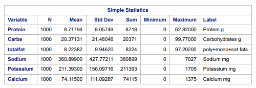 | 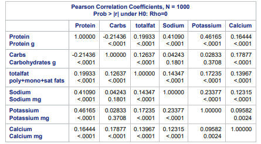

The results of the correlation test with: protein, carbohydrates, fats, sodium, potassium and calcium resulted in:

**Sodium-Protein:** (0.41090) - weak positive correlation

**Potassium-Protein:** (0.46165) - weak positive correlation

**Calcium-Carbohydrate:** (0.17877) - weak positive correlation

This entails that the best macronutrient to consume and abundance of potassium, and sodium are from protein. The best macronutrient to consume an abundance of calcium would be from carbohydrates.


Sodium-Protein      |  Potassium-Protein         | Calcium-Carbohydrate
:-------------------------:|:-------------------------:|:-------------------------:
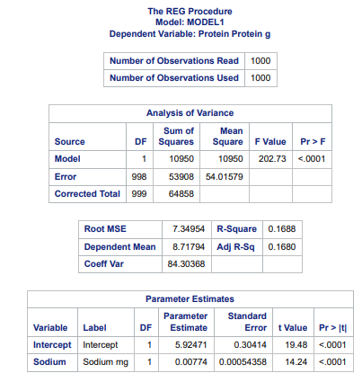 | 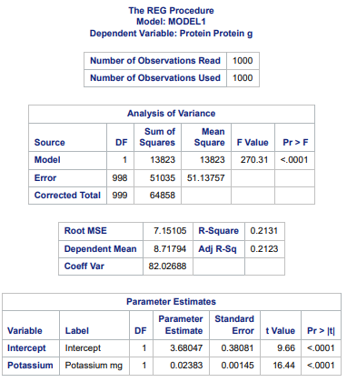     | 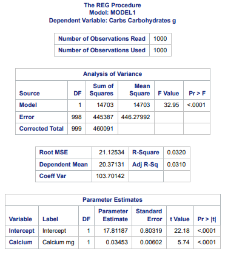

The results from the linear regression models verify that these ftest values (all <.0001) are contributing highly.


### CONCLUSION

